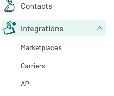
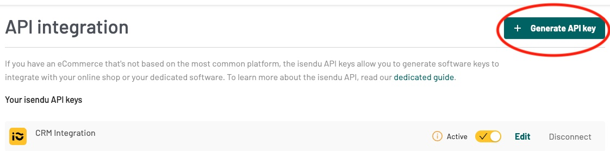
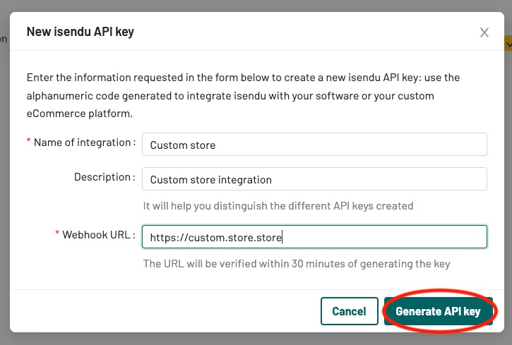
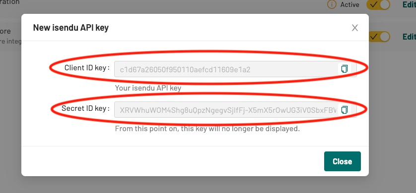
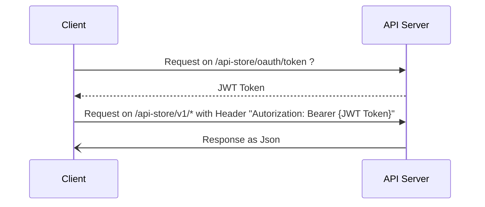

# Getting start

## First get your credentials on isendu dashboard

Search for the API integration section on your dashboard.

Then click on the "Generate API key" button.

Complete the form with the name of your integration, description, and the webook url.

:::caution Important
Webhook url is mandatory. For more information about webhook, see [Webhook](./webhook.md).
:::

Finally, copy the credentials and save them in a secure place.

:::caution Important
Secret ID key os unique and cannot be regenerated. If you lose this, you will have to create a new integration.
:::

## Second: get a token for your requests

Each request on API server **must** be authenticated through a token JWT released in Oauth2 mode client credential. 

:::caution Important
Token route is rate limited: best practice **requires** that the same token be used until its expiration time.
:::