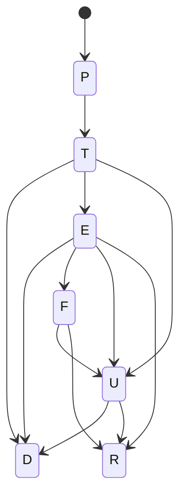

# What are the tracking statuses?

Tracking statuses are the different steps of a shipment delivery.

This is a table of contents of the states that a shipment can have during its delivery.

| status | description                                                           |
|--------|-----------------------------------------------------------------------|
| P      | Shipping created the package must be picked up by the courier company |
| T      | Shipping picked up by the courier and is in transit                   |
| D      | Shipping delivered to the recipient                                   |
| F      | Shipping deliver has failed (some reasons)                            |
| E      | Shipping exception (some reasons)                                     |
| R      | Shipping returned to the sender                                       |
| U      | Shipping status unknown                                               |

Standard flow of a shipment is:

